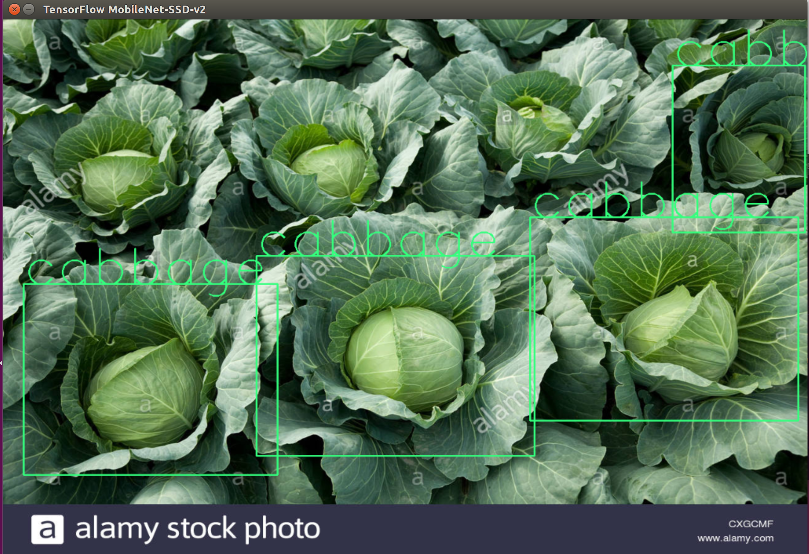

# Real Time cabbage detection with Tensorflow SSD
This project contains all the different files and scrips used to deploy a realtime
cabbage detection algorithm using Tensorflow object detection API. As work task, 
i was in charge to develop and deploy a realtime object detection for a drone.
Basically, the first step and the most time consuming part was to gather the dataset.
In order to do that, we manually took picture of different cabbage field with different point of view.
If you wish to detect a more common object, you can refer to the open source images database to check if your object is included. Here is the [link](https://storage.googleapis.com/openimages/web/index.html)
From those pictures, we could manually label them by using LabelImg. It produces the xml in PASCALVOC format which is easier to use for the following part. To have more information about how to retrain the tensorflow object detection API, please refer to [this link](https://github.com/tensorflow/models/tree/master/research/object_detection).

The goal of this repository is to show how deep learning can be applied in daily life and also to provide examples and codes that can be adapted to some other uses case.

## Table of contents

1. [Installation](#installation)
2. [Utilisation](#utilisation)
3. [Results](#results)
4. [Contributing](#contributing)
5. [License](#licence)

## Installation
This model was trained using a NVIDIA GPU. First of all, please install all the NVIDIA requirements as explained in the official website. [Nvidia official page](https://developer.nvidia.com/).  
Secondly please refer to the official [Tensorflow](https://www.tensorflow.org/install/install_linux#tensorflow_gpu_support) website to know the requirements for the tensorflow-gpu.
>Note: I have exported my model with tensorflow 1.12.0.  Using another version may cause errors, so please export the model yourself with the model checkpoint to fit your tensorflow version. The export can be done by following the [step](https://github.com/tensorflow/models/blob/master/research/object_detection/g3doc/exporting_models.md) here.  

Moreover, I strongly recommend to use virtual environment to do this project else some errors might occur due to the libraries dependencies.  
Virtual environment is good for python development because it can let you having many different working environments which depends on differents libraries without having conflicts.  
If you do not know many about virtual env, [please refer to this excellent tutorial](https://realpython.com/python-virtual-environments-a-primer/)

First of all, please clone the repository to your local machine and do the following command:
- `git clone https://github.com/schoningerJim/cabbageDetection.git`  

Please refer to the requirements.txt to install all the others dependencies. Be sure to be in the virtual environment before typing the following command.
- `pip install -r requirements.txt`

## Utilisation
Once the [Installation](#installation) done, you will have 2 choices:  

- Run the detection in a single thread
- Run the detection with multiprocessing to increase the performance  

Both of the above scrips can take a lot of input parameter to change their behaviour such as the ID of the camera, the camera size, the number of parallel worker for the multi processing script. Run them with the following command but be sure to be in your virtual environment first:  

`python NAME_OF_THE_SCRIPT.py --param1=XX --param2=XX `

## Results

### first training with few images to learn how to use the API
To familiarize myself with the tensorflow object detection API, i ran my first training with only few images (110 for train and 85 for eval). The details of the pipeline can be see in the pipelin config file itself.  

  

The first resuslt is that the network can not detect the picture who look too different than the dataset. Plese see the below picture as result.
Secondly, the user can also use tensorRT library to optimize the tensorflow model for a NVIDIA device.

### Idea of optimisation
Basically, in order to increase the performance in accuracy, we have to increase the dataset with a lot of picture with different point of view and angle.
## Contributing

## Licence
Apache Licence. See [LICENSE](LICENSE) for details. Copyright (c) 2018 Enroute.
